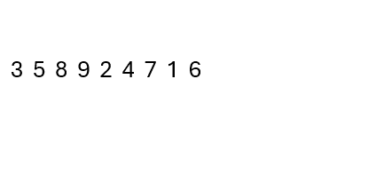
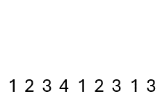

# Bijection between permutations and a special kind of sequence

## Description

This programme implements the bijection between two sets of sequences featured in 2002 IMO Shortlist Problem C3.

The programme recursively generates permutations, maps any permutation to a full sequence, and maps any full sequence to a permutation.

## The Problem

As originally formulated, the problem is to determine the number of positive integer sequences of length $n$ with the following properties:
* For any integer $k\ge 2$, if $k$ appears in the sequence, so does $k-1$, and
* the last occurrence of $k$ must be after the first occurrence of $k-1$.

Through listing out the full sequences for $n=1, 2, 3, 4$ we get answers of $1, 2, 6, 24$, and this leads us to hypothesise that the answer is $n!$. 

It turns out that this is indeed correct, due a bijection between the set of such length-$n$ sequences (we call them full sequences) and the set of permutations of $(1, 2, \dots, n)$. We describe the bijection in the solution below.

## The Solution

Given any permutation of $1, 2, \dots, n$, we search for the positions of $1$, $2$, and so on. We may observe that $2$ is to the left of $1$, and $3$ is further left of $2$, and so on, until some point $k$ (i.e. as we search for $1, 2, \dots, k$ we kept moving left), and then $k+1$ is to the right of $k$.

Continuing, we may notice $k+2$ is to the left of $k+1$, and $k+3$ is to the left of $k+2$, and so on until some point $k+l$, where $k+l+1$ is to the right of $k+l$.

Essentially, we are repeatedly scanning the sequence from right to left, trying to find the numbers in increasing order $1, 2, \dots, n$, but because of how the numbers may be jumbled up in order, a single scan from right to left is almost certainly insufficient. We need to restart from the right and scan again, repeating this as many times as necessary, until we have found all $n$ numbers in increasing order. This is the idea of the bijection.

For example, in the permutation $(3, 5, 8, 9, 2, 4, 7, 1, 6)$, the first scan from right to left can only find $1, 2, 3$ - to find $4$ we need to start again from the right, because $4$ is to the right of $3$. In total, we need $4$ scans:

* $3 \leftarrow 2 \leftarrow 1$
* $5 \leftarrow 4$
* $8 \leftarrow 7 \leftarrow 6$
* $9$


How do we turn this into a full sequence of length $n$? The fact that we had to scan again from the right when $k+1$ is to the right of $k$ feels very reminiscent of the defining property of a full sequence. 

This motivates the following operation: where we found numbers in the $k$-th scan of the permutation, we write $k$ in those positions of our full sequence. That means, for our example permutation, since the first scan only found $1, 2, 3$, we write $1$'s in the first, fifth, and eighth positions of the full sequence, since those are where $1, 2, 3$ are in the example permutation. We end up with the partial sequence $(1, -, -, -, 1, -, -, 1, -)$.

Analogously, we write $2$'s in the same positions where $4, 5$ are found in the permutation, to get $(1, 2, -, -, 1, 2, -, 1, -)$. 

Repeating this for the third and fourth scans, we end up with the sequence $(1, 2, 3, 4, 1, 2, 3, 1, 3)$.



This method of forming a sequence obviously satisfies the first condition - if $k\ge 2$ appears then so must $k-1$. This is because if $k$ appears, then we must have made at least $k$ scans, so where we found numbers in the $(k-1)$-th scan, the number $k-1$ will appear in our full sequence as well.

Furthermore, we start a new scan (say $(k+1)$-st scan) only when the next number (say $m+1$) in the permutation to find is to the right of the last number $m$ found (in the $k$-th scan). The position of $m+1$ would then be the rightmost position of $k+1$ in our full sequence, since after we find $m+1$ in the $(k+1)$-st scan we would only keep scanning left. The position of $m$ would be the leftmost position of $k$ in our full sequence, since after finding $m$ we cannot find the next number to the left of $m$ in the $k$-th scan. Hence, the last occurrence of $(k+1)$ always appears to the right of the first occurrence of $k$.

This algorithm of creating a full sequence from a permutation can easily be reversed. Given our full sequence $(1, 2, 3, 4, 1, 2, 3, 1, 3)$, we know the rightmost position of $1$ is the occurrence of the smallest number in the permutation, which is $1$. Since there are $3$ occurrences of $1$ in the full sequence, in the first scan we must have found $3$ numbers, namely $1, 2, 3$. Then we fill in $1, 2, 3$ in the positions of the $1$'s in the full sequence, to get the incomplete permutation $(3, -, -, -, 2, -, -, 1, -)$.

Now we find the $2$'s in our full sequence. Since there are $2$ occurrences, we fill in the next two numbers, $4, 5$ in the permutation to get $(3, 5, -, -, 2, 4, -, 1, -)$.

Repeating this two more times for $3$ and $4$, we get back the original permutation $(3, 5, 8, 9, 2, 4, 7, 1, 6)$.



## The Programme

Running `biject.py` prompts the user to input one of three letters:
* A to output all permutations and corresponding full sequences of length $n$
* P to map a given permutation to a full sequence
* F to map a given full sequence to a permutation

```Text
Choose one:
Generate all (A)
Map a permutation to a full sequence (P)
Map a full sequence to a permutation (F)
```

If `A` was selected, the user is prompted to input the value of $n$, and then all permutations and full sequences will be output, 1 pair per line, in the format `permutation: full sequence`

```Text
Select n: 3
(1, 2, 3): (1, 2, 3)
(1, 3, 2): (1, 2, 2)
(2, 1, 3): (1, 1, 2)
(2, 3, 1): (1, 2, 1)
(3, 1, 2): (2, 1, 2)
(3, 2, 1): (1, 1, 1)
```

If `P` was selected, the user is prompted to input a space-separated valid permutation of $1, 2, \dots, n$ where $n$ is any positive integer, then the full sequence corresponding to it will be output as a tuple.

```Text
Type a permutation with space-separated elements.
3 1 2
(2, 1, 2)
```

If `F` was selected, the user is prompted to input a space-separated valid full sequence of any length $n$, then the permutation of $1, 2, \dots, n$ corresponding to it will be output as a tuple.

```Text
Type a full sequence with space-separated elements.
1 1 2
(2, 1, 3)
```