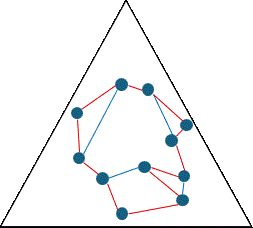
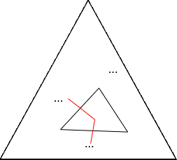
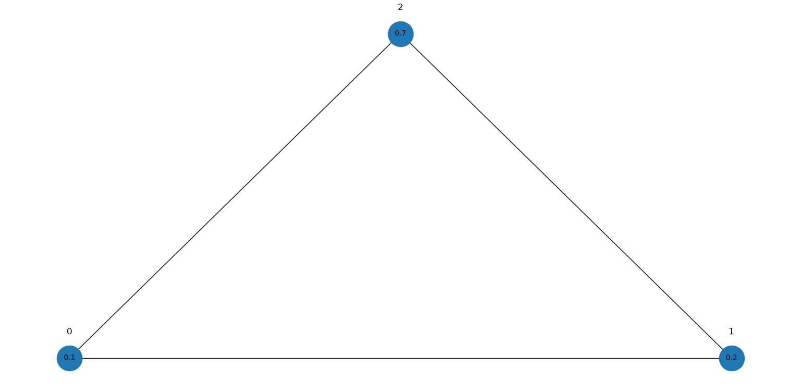
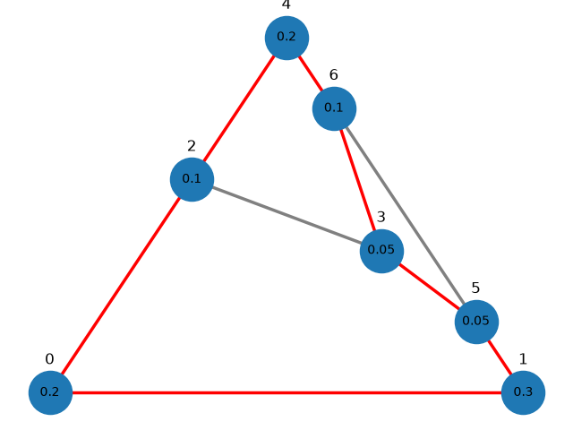

# Implementing the solution to an Olympiad combinatorics game

## Description

This programme implements a two-player game featured in problem 1 of 2026 Romanian Masters of Mathematics (RMM). 

This programme makes use of the mathematical logic behind the optimal strategies of the players in games of arbitrary size $n$, preventing a naive brute force search.

## The Problem

Set a positive integer $n$.

Alice starts by drawing a triangle of area $1$. Afterwards, she repeatedly chooses a triangle $ABC$ with no marked points in its interior, marks a point $P$ inside, and splits $ABC$ into three smaller triangles by drawing the edges $PA, PB, PC$, for a total of $n$ turns.


Bob must then choose three triangles $\Delta_1, \Delta_2, \Delta_3$, each of which having no marked points in their interiors, such that $\Delta_2$ shares an edge with both $\Delta_1$ and $\Delta_3$. The goal of Bob is to maximise the sum of areas of $\Delta_1, \Delta_2, \Delta_3$.


## The Solution

We will translate this into a Graph Theory problem. Each small triangle (with no interior marked points) corresponds to a node on a graph, and whenever two small triangles share an edge, we draw an edge between their corresponding nodes.

Bob needs to pick 3 nodes $V_1, V_2, V_3$ so that $V_1V_2$ and $V_2V_3$ are both edges, and maximise the sum of areas of the triangles corresponding to $V_1, V_2, V_3$.


Notice if Alice makes all the triangles the same area, then no matter what Bob does, the sum of areas of the $3$ chosen triangles will be the same. Since Alice creates $2n+1$ triangles in $n$ moves, the sum of areas of the $3$ chosen triangles will be $\frac{3}{2n+1}$ in this case.

Bob can guarantee no better than $\frac{3}{2n+1}$, but can he guarantee $\frac{3}{2n+1}$ if Alice is free to choose how she divides up the triangle? As it turns out, the answer is yes. This is because no matter how Alice divides up the triangle, we can always find a way to walk along our graph, traversing each node exactly once, and get back to the starting node. We will show this later.

After we find such a cycle (called a Hamiltonian cycle), for any $3$ consecutive nodes along this cycle, we check their sum of areas. Since each node is checked $3$ times as we do this down the cycle, if we add up all the sums of areas, we get $3$ times the sum of areas of all the small triangles, which is just $3$ times the area of the original triangle. Then $\frac{3}{2n+1}$ would be the mean sum of areas of $3$ consecutive nodes, so Bob can definitely find $3$ consecutive nodes whose sum of areas is at least this value.



Now why does the Hamiltonian cycle exist in the first place? The reason is that we can find it inductively as Alice makes each move. On Alice's first move, the layout of the triangles is very simple, and we can obviously find a Hamiltonian cycle traversing the small traingles:


Suppose before Alice makes a new move there already exists a Hamiltonian cycle. After Alice makes a move on a triangle $\Delta$, observe what happens to the Hamiltonian cycle around $\Delta$. We can extend the cycle to include all the smaller triangles into which Alice split $\Delta$, as follows, which completes our inductive step.



This inductive process of building up our Hamiltonian cycle is the main logic behind the programme.

## The Programme

The programme requires `matplotlib` and `networkx` to display images of the graph.

When running game.py, the user is first prompted to input a value for $n$.

```Text
Select number of moves n for Alice: 3
```

Immediately after, it will print a triple in the format (label, area, neighbours_list). This triple represents the node corresponding to the starting unit triangle. The triangle labels will range from $0$ to $2k$ where $k$ is the number of moves that Alice has made up to this point.

```Text
Current triangles in the format (label, area, neighbours_list):
(0, 1.0, [None, None, None])
```

Along with the triple, it generates an image showing just that one node. The area is written inside the node, and the label is written above the node.

Afterwards, the user plays as Alice, repeatedly being prompted to select triangle to split, and select the areas to split the triangle into by entering $3$ space-separated floats. 

```Text
Select triangle to split: 0
```

```Text
(0, 1.0, [None, None, None])
Select split areas: 0.1 0.2 0.7
```

For example, if triangle $3$ is represented by the tuple `(3, 0.4, [0, 1, 2])`, then typing `0.1 0.1 0.2` will split triangle $3$ into smaller triangles $\Delta_1$, $\Delta_2$, $\Delta_3$ of areas $0.1, 0.1, 0.2$ respectively. Here, $\Delta_1$ is the small triangle bordering triangle $0$, since `0` is the first entry in the list of neighbours `[0, 1, 2]` of triangle $3$. Analogously, $\Delta_2$ is the small triangle bordering triangle $1$, and $\Delta_3$ is the small triangle bordering $2$.

Each time after making a move for Alice, the list of all triangles will be output again, along with an image showing the graph at this time.

```Text
Current triangles in the format (label, area, neighbours_list):
(0, 0.1, [None, 1, 2])
(1, 0.2, [0, None, 2])
(2, 0.7, [0, 1, None])
```


Each time a triangle of label $x$ is split into $3$ on move $k+1$, one of the $3$ smaller triangles retains the label $x$, and the other two smaller triangles will have labels $2k+1$ and $2k+2$.

After the last turn, the user is asked whether they want to view all triangles. Typing `y` will display the list of all tuples representing the triangles, and generate the image of the graph again.

```Text
View all current triangles? (y/n)
```

Afterwards, the choices for Bob which give a total area at least $\frac{3}{2n+1}$ will be displayed:

```Text
Bob chooses the following triangles:
(0, 0.2, [None, 1, 2])
(1, 0.3, [0, None, 5])
(5, 0.05, [3, 1, 6])
Sum of areas: 0.6
```

Finally, the user is asked whether they want to view the Hamiltonian cycle. Typing `y` will print the labels in order of the cycle, and display the image of the graph with the cycle edges in red.

```Text
View Hamiltonian cycle? (y/n) y
[0, 1, 5, 3, 6, 4, 2, 0]
```

